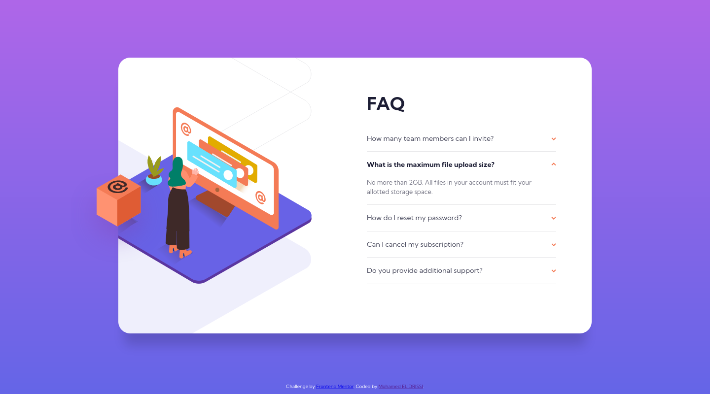

# Frontend Mentor - FAQ accordion card solution

This is a solution to the [FAQ accordion card challenge on Frontend Mentor](https://www.frontendmentor.io/challenges/faq-accordion-card-XlyjD0Oam). Frontend Mentor challenges help you improve your coding skills by building realistic projects. 

## Table of contents

- [Overview](#overview)
  - [The challenge](#the-challenge)
  - [Screenshot](#screenshot)
  - [Links](#links)
- [My process](#my-process)
  - [Built with](#built-with)
  - [What I learned](#what-i-learned)
  - [Continued development](#continued-development)
  - [Useful resources](#useful-resources)
- [Author](#author)
- [License](#license)

## Overview

### The challenge

Users should be able to:

- View the optimal layout for the component depending on their device's screen size
- See hover states for all interactive elements on the page
- Hide/Show the answer to a question when the question is clicked

### Screenshot

| Mobile (375px) | Deskop (1440px) |
| --- | --- |
|  |  |

### Links

- Solution URL: [Add solution URL here](https://your-solution-url.com)
- Live Site URL: [Add live site URL here](https://your-live-site-url.com)

## My process

### Built with

- Semantic HTML5 markup
- CSS custom properties
- Flexbox
- Mobile-first workflow
- [Parcel](https://parceljs.org/)

### What I learned

I learned in this challenge about the `details` and `summary` elements that can be used to build an accordion, it was funny because I stumbled accross them only after building the entire thing with javascript :D, but still better late than never.

### Continued development

Positioning the image in both desktop and mobile was the most difficult part of this challenge for me. I was confused at first if I should be using a background image on a `div`, an `img`, or `::before` pseudo-class which is what I ended up using. Hopefully in the next challenges It will get easier as I get to practice it more.

### Useful resources

- [\<details\>: The Details disclosure element](https://developer.mozilla.org/en-US/docs/Web/HTML/Element/details) - This helped me to know how to use `details` and `summary` HTML elements to create an accordion. 

## Author

- Website - [Mohamed ELIDRISSI](https://www.elidrissi.dev)
- Frontend Mentor - [@elidrissidev](https://www.frontendmentor.io/profile/elidrissidev)

## License

This project is licensed under the [MIT License](LICENSE.txt).
